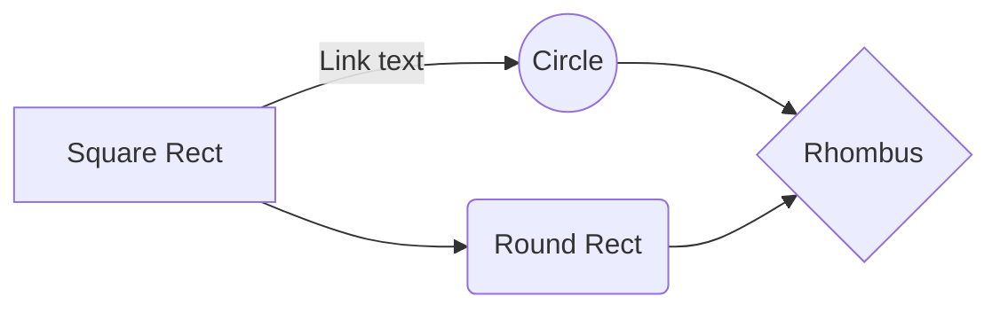

---
title: "UML diagram"
author: "billhennessy"
draft: false
--

> Written with [StackEdit](https://stackedit.io/).
<!--stackedit_data:
eyJwcm9wZXJ0aWVzIjoidGl0bGU6IFVNTCBEaWFncmFtXG5hdX
Rob3I6IGJpbGxoZW5uZXNzeVxudGFnczogdW1sXG5jYXRlZ29y
aWVzOiBMaXZpbmdcbmZlYXR1cmVkSW1hZ2U6IC9pbWFnZXMvaG
VubmVzc3kucG5nXG5zdGF0dXM6IHB1Ymxpc2hlZFxuIiwiaGlz
dG9yeSI6Wy0xOTU1OTE3MDE2LDQ2NjU2OTcwN119
-->