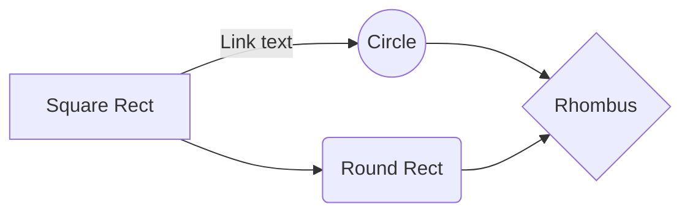

---
title: "UML diagram"
author: "billhennessy"
draft: false
--

```mermaid
graph LR
A[Square Rect] -- Link text --> B((Circle))
A --> C(Round Rect)
B --> D{Rhombus}
C --> D
```

> Written with [StackEdit](https://stackedit.io/).
<!--stackedit_data:
eyJoaXN0b3J5IjpbNDY2NTY5NzA3XX0=
-->