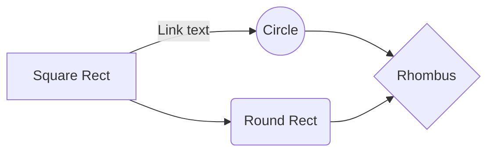

=======
```


<!--stackedit_data:
eyJwcm9wZXJ0aWVzIjoidGl0bGU6IFVNTCBEaWFncmFtXG5hdX
Rob3I6IGJpbGxoZW5uZXNzeVxudGFnczogdW1sXG5jYXRlZ29y
aWVzOiBMaXZpbmdcbmZlYXR1cmVkSW1hZ2U6IC9pbWFnZXMvaG
VubmVzc3kucG5nXG5zdGF0dXM6IHB1Ymxpc2hlZFxuIiwiaGlz
dG9yeSI6Wy0xOTA2ODk0MjIyLDE0MTA5Mjk0LC0xOTU1OTE3MD
E2LDQ2NjU2OTcwN119
-->
<!--stackedit_data:
eyJwcm9wZXJ0aWVzIjoidGl0bGU6IFVNTCBEaWFncmFtXG5hdX
Rob3I6IGJpbGxoZW5uZXNzeVxudGFnczogdW1sXG5jYXRlZ29y
aWVzOiBMaXZpbmdcbmZlYXR1cmVkSW1hZ2U6IC9pbWFnZXMvaG
VubmVzc3kucG5nXG5zdGF0dXM6IHB1Ymxpc2hlZFxuIiwiaGlz
dG9yeSI6Wy0xODU2ODIwNjgwXX0=
-->
>>>>>>> 1280a2343da1e8f33dda8e106dc5806ac8a15415
